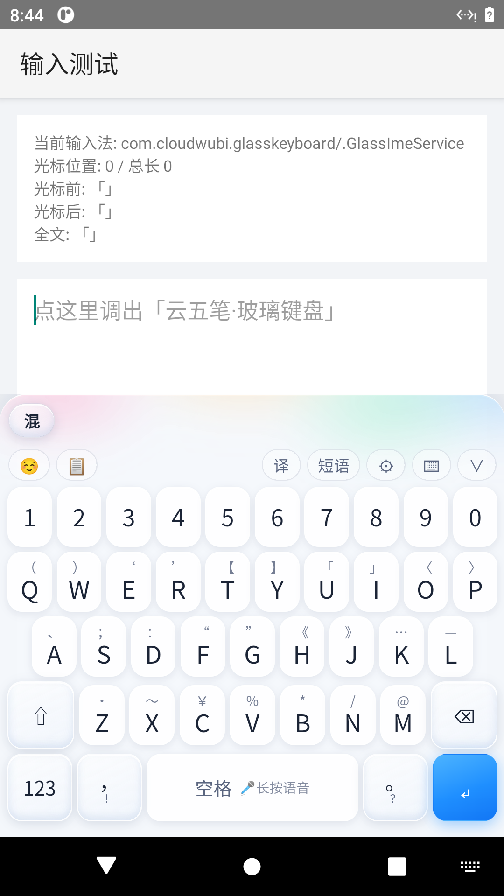
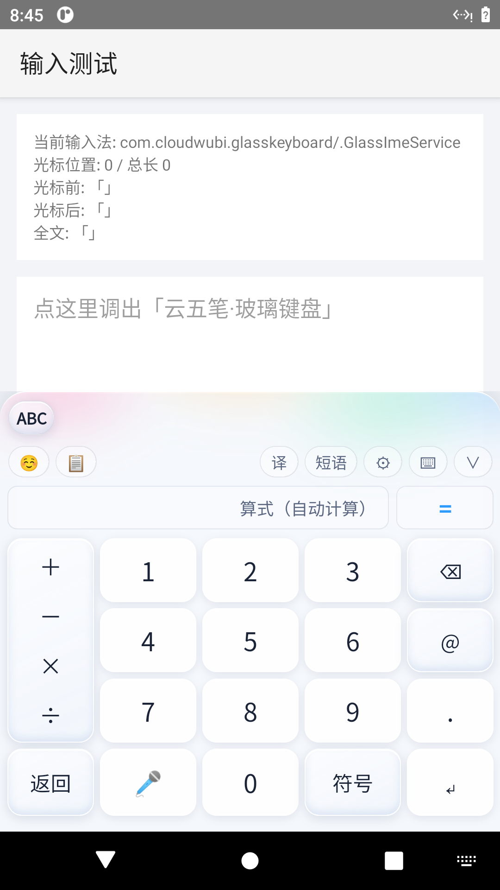

# 云五笔 · 玻璃键盘 CloudWubi Glass Keyboard

> iOS 液态玻璃质感、超科技感的手机输入法：**五笔词组 + 中英混输 + 语音输入 + 实时计算**，为简体中文用户打造。

[](LICENSE)
[](#下载与安装)
[-orange)](#从源码构建)
[](CONTRIBUTING.md)

一款以 **Android 系统输入法（IME）** 形态运行的键盘，可在任意 App 的输入框中调出。视觉采用半透明磨砂玻璃、流体彩色光斑与内发光；输入内核基于五笔 86 方案，同时把语音、计算器、翻译、表情等能力收敛到统一、无感切换的界面中。

---

## 功能特性

### 五笔输入
- **五笔 86 方案**，词库约 **7.4 万条 / 6.8 万编码组**，覆盖单字、二字到五字词、常用长词。
- 一级 / 二级 / 三级简码与全码完整；**四码时词组优先**，简码时高频锚字置顶。
- **词频自学习**：刚上屏的字 / 词再次输入自动靠前，最近上屏优先。
- 严格遵循使用规则：有编码时回车只上屏编码、空格上首候选、点选上屏、空候选回车换行；**词库仅含简体字**。

### 中英混输
- 中英文、数字**无需切换即可混合输入**；左上角按键在「混 / 中 / EN」间切换。
- 英文输入支持自动大小写、单词与短句智能补全。
- 可对当前文本框中的词组进行**联想与翻译**，并跟随光标位置实时变化。

### 语音输入
- **长按空格**启动语音、点击仍是空格，键盘各面板一致。
- 实时**声波示波器**，真实反映音量大小。
- 调用系统 `SpeechRecognizer`，自动选择可用引擎；具备**超时与错误兜底**，不再卡在「识别中」。

### 数字与计算
- 专门的数字键盘（电话盘：1 在左上、0 在 8 正下方，左侧竖排运算符）。
- 输入数字与运算符**实时自动计算，但不自动上屏**，选择后才上屏。
- 可分别上屏**「公式 + 结果」**或**纯结果**，并能在结果后继续运算（连续计算）。

### 标点、表情与手势
- 字母键**上滑输入标点**（键面字母上方有小号标点提示）。
- 底排标点键可在「，！」「。？」间切换；另有专门的符号面板与表情面板，分页可手拖平滑滑动。
- 顶部下滑收起键盘、空格横拖移动光标。

### 安全与触感
- **密码框适配**：文本密码 / 数字密码下不自动大写首字母、不读取剪贴板、不做语义泄露。
- 按键触点视觉反馈 + **轻微震动**（可在设置中关闭）。
- 三套主题：亮域通透（默认）、深空冰蓝、幻紫全息。

---

## 界面预览

| 字母主键盘 | 数字 / 计算键盘 |
| :---: | :---: |
|  |  |

---

## 下载与安装

### 方式一：安装预编译 APK（推荐真机实测）
1. 到 [Releases](https://github.com/) 页面下载最新 `CloudWubiGlassKeyboard-lite-vX.X-debug.apk` 并安装。
2. 打开「云五笔」App：
   - 点 **启用云五笔输入法**，在系统设置中勾选「云五笔」；
   - 点 **切换为云五笔**，在弹窗中选择本输入法；
   - 使用语音请按提示**授权麦克风**。
3. 在任意 App 输入框点击，即可调出玻璃键盘。

> 当前公开的安装包为 **debug 签名**，可直接安装真机实测；如需上架应用商店需使用正式签名重新打包。

### 方式二：从源码构建
需要 **JDK 11** 与 **Android SDK**（Platform android-33、Build-Tools 33.0.2）。

```bash
git clone <repo-url> CloudWubi-Glass-Keyboard
cd CloudWubi-Glass-Keyboard
./gradlew assembleDebug
# 产物：app/build/outputs/apk/debug/app-debug.apk
```

安装到设备：
```bash
adb install -r app/build/outputs/apk/debug/app-debug.apk
```

---

## 快速上手

| 操作 | 行为 |
| :--- | :--- |
| 输入五笔编码 + 空格 | 上屏第一个候选（不带空格） |
| 输入编码 + 回车 | 只上屏当前编码字母，不上中文 |
| 点候选栏 | 上屏指定字 / 词 |
| 长按空格 | 语音输入（看声波，松手识别） |
| 字母键上滑 | 上屏该键对应的标点 |
| 底排 `，！` / `。？` 键 | 点击切换并上屏对应标点 |
| 数字盘输入算式 | 实时出结果，点「公式」或「结果」选择上屏 |
| 顶部区域下滑 | 收起键盘 |

---

## 常见问题 FAQ

**为什么语音在我的手机上没有识别结果？**
语音依赖系统内置的语音识别引擎。部分机型（如未安装/禁用 Google、讯飞、厂商引擎）可能无可用引擎，键盘会在超时后给出错误码而不是卡死。可在「设置 → 诊断」中查看检测到的引擎，并安装相应语音引擎。

**为什么有些词组打不出来？**
端侧词库已包含常用长词；更海量的用户词、超长句与跨设备同步将由**云端词库**承担（规划中）。欢迎在 Issues 中提交缺失的常用词。

**iOS / 鸿蒙 / Windows 什么时候支持？**
本项目当前优先打磨 Android。iOS 需 macOS + Xcode 签名、鸿蒙 NEXT 需 DevEco 与华为签名、Windows 需 TSF 框架，均无法在当前 Linux 环境构建；Android 稳定后再评估跨端路线。

**会收集我的输入内容吗？**
请参阅 [PRIVACY.md](PRIVACY.md)。语音与翻译功能仅在你主动触发时，分别发送给系统语音服务与翻译接口；核心五笔输入完全在本地完成。

---

## 路线图

- [x] Android 系统输入法 + 液态玻璃视觉
- [x] 五笔 86 词库、简码、词频自学习
- [x] 中英混输、英文补全、光标跟随翻译
- [x] 语音输入（示波、超时兜底）
- [x] 数字计算键盘（公式 / 结果可选）
- [x] 密码框适配、触感反馈
- [ ] 云端长词库与用户词跨设备同步
- [ ] 一键回归脚本持续集成
- [ ] 无障碍（大字体 / 读屏）
- [ ] iOS / 鸿蒙 / Windows 跨端评估

---

## 致谢与开源许可

- 五笔词库源自 [KyleBing/rime-wubi86-jidian](https://github.com/KyleBing/rime-wubi86-jidian)（**Apache-2.0**），并参考 [rime/rime-wubi](https://github.com/rime/rime-wubi)（**LGPL-3.0**）。
- 简繁转换使用 [opencc-js](https://github.com/nk2028/opencc-js)（Apache-2.0）；单字以《通用规范汉字表》8105 字为白名单。
- 翻译使用免费的 MyMemory 接口。

本项目原创代码以 **Apache License 2.0** 发布，数据与第三方组件的许可详见 [NOTICE](NOTICE) 与 [LICENSE](LICENSE)。

## 贡献

欢迎提交 Issue、Pull Request 与词库补充，流程见 [CONTRIBUTING.md](CONTRIBUTING.md)。版本变更见 [CHANGELOG.md](CHANGELOG.md)。
